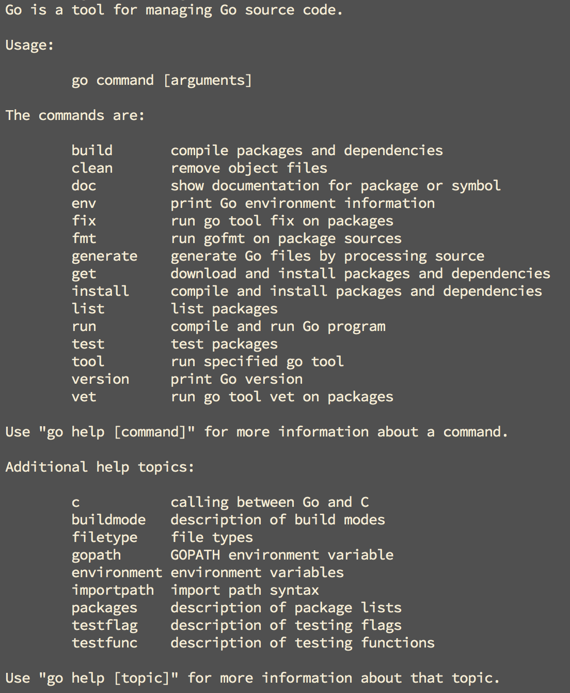
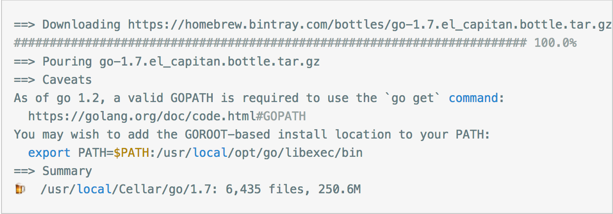

# go安装


安装有多种方式 


## linux / unix /maxos 安装

### linux install

此方式为使用以编译二进制压缩包安装64位 go

安装步骤: 

1. 下载go 安装好

   ```go
   // 按照系统保本和go 版本更改链接
   $ wget https://storage.googleapis.com/golang/go1.8.3.linux-amd64.tar.gz
   ```

2. 解压到 ` /usr /local`

   ```go
   $ sudo tar -C /usr/local -xzf go1.8.3.linux-amd64.tar.gz
   ```

3. 修改 ` PATH 环境变量`

   ```go
   $ vim ~/.profile  # 或者 ~/.bashrc
   // 添加: export PATH=$PATH:/usr/local/go/bin
   
   ```

4. (可选) 设置 `GOPATH`

   ```go
   // go1.8及后续版本在没有设置GOPATH时，会默认以$HOME/go为GOPATH
   // GOPATH为你的工作目录，其可以为任意合法目录
   $ vim ~/.profile  # 或者 ~/.bashrc
   // 添加: export GOPATH=$HOME/go
   ```

5. 然后进行检测, 执行` go`



上图是 linux 系统下安装成功后执行 go 显示的信息

如果出现 go 的 usage 信息. 那么 go 已经安装成功了

如果痴线该命令不存在, 那么可以检查一下自己的path 环境变量中 是否存在go 的安装目录


### Mac OS 安装

建议使用 HomeBrew 安装

```go
// 安装go
brew install go

// 更新go
brew upgrade go
```

- 安装过程大同小异, 会自动安装 go 的最新稳定版本, 因为我已经安装好了没有截图, 所以剽窃了一张别人, 好让大家有个参考



- 出现上面的结果就表示安装成功了，我们在终端输入**\*go version***查看我们的安装版本，我的显示**go version go1.10.2 darwin/amd64，**表示我安装的是v1.10.2版本。

#### 配置 `gopath`

- 查看 go 的环境变量设置的命令

> go env

- 结果

  ```go
  GOARCH="amd64"
  GOBIN=""
  GOCACHE=""
  GOEXE=""
  GOHOSTARCH="amd64"
  GOHOSTOS="darwin"
  GOOS="darwin"
  GOPATH=""
  GORACE=""
  GOROOT="/usr/local/Cellar/go/1.10.2/libexec"
  GOTMPDIR=""
  GOTOOLDIR="/usr/local/Cellar/go/1.10.2/libexec/pkg/tool/darwin_amd64"
  GCCGO="gccgo"
  CC="clang"
  CXX="clang++"
  CGO_ENABLED="1"
  CGO_CFLAGS="-g -O2"
  CGO_CPPFLAGS=""
  CGO_CXXFLAGS="-g -O2"
  CGO_FFLAGS="-g -O2"
  CGO_LDFLAGS="-g -O2"
  PKG_CONFIG="pkg-config"
  GOGCCFLAGS="-fPIC -m64 -pthread -fno-caret-diagnostics -Qunused-arguments -fmessage-length=0 -fdebug-prefix-map=/var/folders/cf/lgqwwx4x1xs3rgp5rn0vz41h0000gn/T/go-build392342221=/tmp/go-build -gno-record-gcc-switches -fno-common"
  ```

- 命令行

  ```go
  cd ~
  
  vim .bash_profile
  
  //新增
  xport GOROOT=/usr/local/opt/go/libexec
  export GOPATH=$HOME/.go
  export PATH=$PATH:$GOROOT/bin:$GOPATH/bin
  ```

- 测试: 

  ```python
  vim hello.go
  
  // hello.go
  package main
  import "fmt"
  
  func main() {
    fmt.Printf("Hello, world!")
  }
  ```


### Windows 安装

按照系统对应下面下载地址下载：

- 32位系统下载 go1.8.3.windows-386.msi
- 64位系统下载 go1.8.3.windows-amd64.msi

双击打开下载的文件，一路按照默认点击下一步即可。